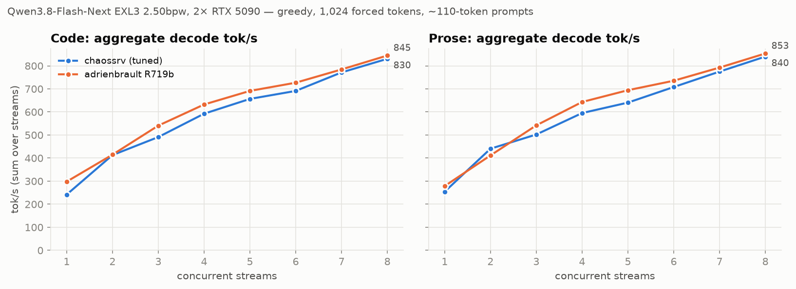
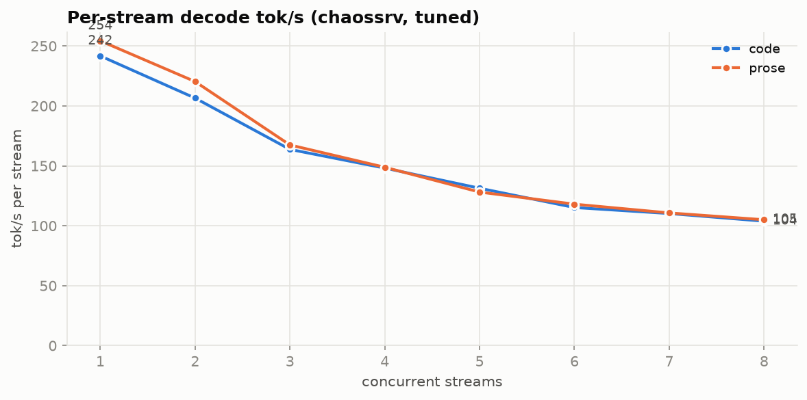
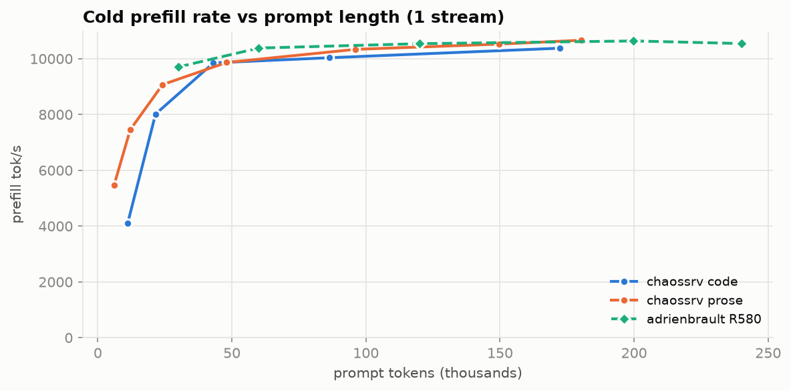
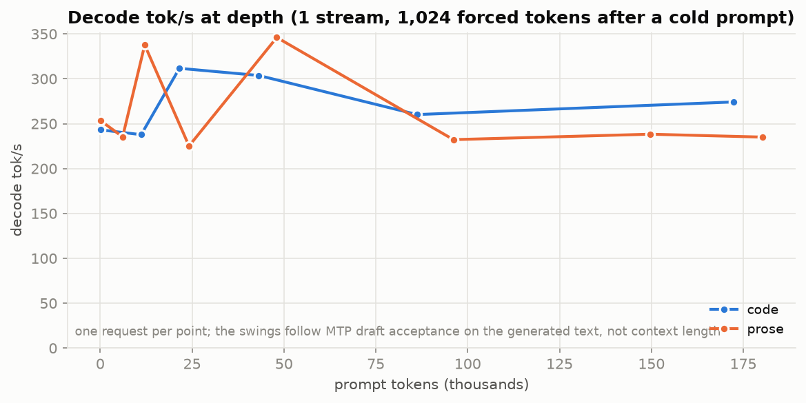
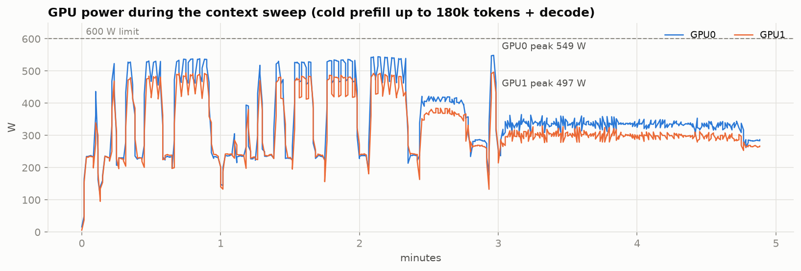
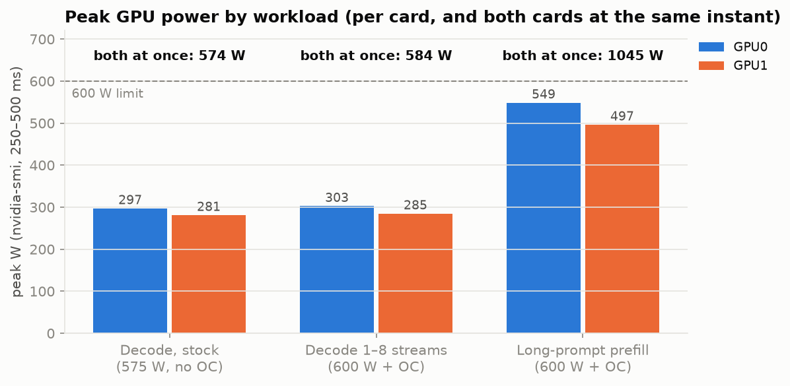
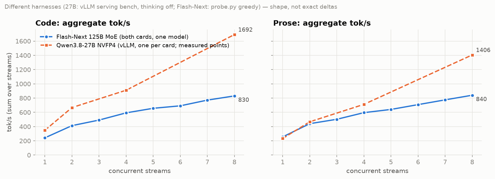
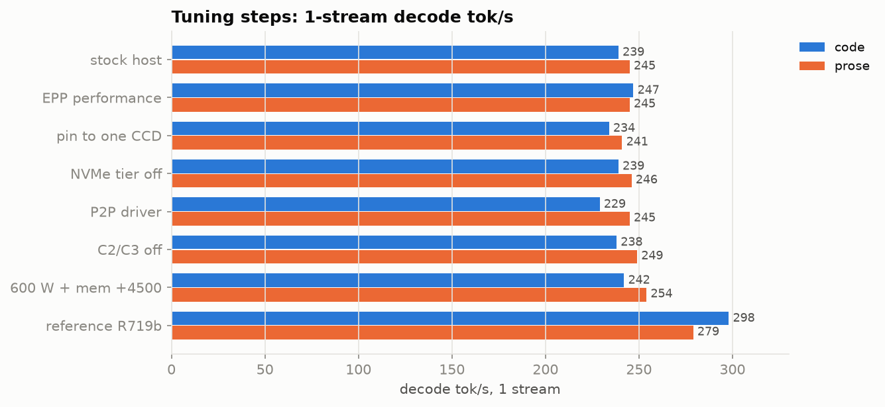
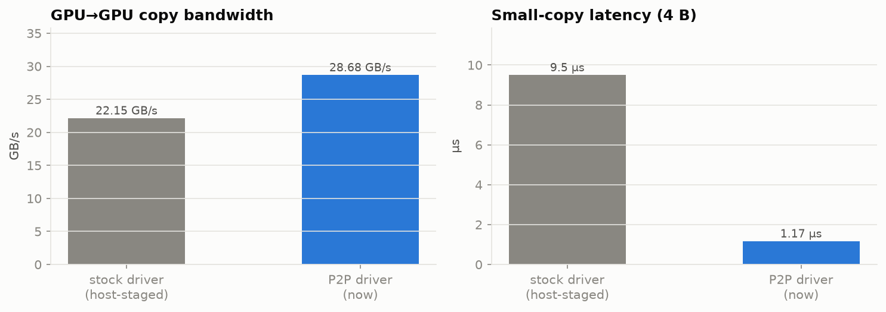

# Qwen3.8-Flash-Next on 2× RTX 5090: chaossrv fork

This fork reproduces [adrienbrault/qwen3.8-flash-next-2x-rtx5090](https://github.com/adrienbrault/qwen3.8-flash-next-2x-rtx5090) on a second machine: [Qwen3.8-Flash-Next](https://huggingface.co/unsloth/Qwen3.8-Flash-Next-GGUF) (125B MoE, about 6B active per token) as [r0b0tlab's 2.50 bpw EXL3 pack](https://huggingface.co/r0b0tlab/Qwen3.8-Flash-Next-EXL3-2.50bpw), served by [TabbyAPI](https://github.com/theroyallab/tabbyAPI) on [ExLlamaV3](https://github.com/turboderp-org/exllamav3) v1.5.0 with the upstream patch stack (`tabbyapi:stack-r3-rows32`), layer split across two RTX 5090 cards. The upstream README is kept unchanged as [`README.old.md`](README.old.md); every upstream write-up under `bench/results/` is unchanged.

The fork adds a rootless-podman build of the 35-layer image chain with three fixes, a podman launcher, a read-only `/live` endpoint, host tuning, a host monitor, and the measurements below, all taken on 2026-09-25. Raw records are in [`hosts/chaossrv/results/`](hosts/chaossrv/results/); the charts are rendered from them by [`hosts/chaossrv/charts.py`](hosts/chaossrv/charts.py).

## Numbers

Decode, greedy, 1,024 forced tokens (`min_tokens`), 118-token code and 106-token prose prompts, `bench/probe.py --distinct`, one warm-up and three recorded rounds per shape (the R719b method). Tuned host: CPU EPP `performance`, C2/C3 off, GPU power limit 600 W, memory clock offset +4500, P2P driver loaded. Rates are tokens per second after each request's first token; the aggregate is the per-stream median times the stream count.

| streams | code per stream | prose per stream | code aggregate | prose aggregate | R719b code aggregate | R719b prose aggregate |
| ---: | ---: | ---: | ---: | ---: | ---: | ---: |
| 1 | 241.7 | 254.3 | 242 | 254 | 298 | 279 |
| 2 | 206.5 | 220.3 | 413 | 441 | 415 | 412 |
| 3 | 163.7 | 167.4 | 491 | 502 | 541 | 542 |
| 4 | 148.1 | 148.8 | 592 | 595 | 632 | 643 |
| 5 | 131.3 | 128.1 | 656 | 640 | 691 | 694 |
| 6 | 115.2 | 118.0 | 691 | 708 | 727 | 735 |
| 7 | 110.2 | 110.7 | 771 | 775 | 784 | 792 |
| 8 | 103.8 | 105.0 | 830 | 840 | 845 | 853 |

Against R719b the aggregate is −18.8 % (code) and −8.7 % (prose) at 1 stream, −0.4 % and +7.1 % at 2 streams, −4.9 to −9.2 % (code) and −3.7 to −7.7 % (prose) at 3 to 6 streams, and −1.6 to −2.2 % at 7 and 8 streams (`results/oc4500/`).





### Prefill and decode at depth

One stream, cold salted filler per depth (`--unique --salt`), 1,024 forced greedy tokens after the prompt (`results/ctxsweep/`). The prefill rate is prompt tokens over time to first token.

| prompt tokens (code / prose) | prefill t/s (code / prose) | decode t/s (code / prose) | R580 prefill |
| --- | --- | --- | --- |
| 118 / 106 | n/a | 243 / 253 | |
| 11,145 / 6,102 | 4,103 / 5,478 | 238 / 235 | |
| 21,545 / 12,108 | 8,015 / 7,456 | 312 / 338 | |
| 43,130 / 24,167 | 9,849 / 9,072 | 304 / 225 | 9,706 at 30,133 |
| 86,241 / 48,061 | 10,034 / 9,865 | 260 / 346 | 10,381 at 60,014 |
| 172,343 / 96,132 | 10,376 / 10,335 | 274 / 232 | 10,538 at 120,075 |
| n/a / 149,679 | n/a / 10,522 | n/a / 238 | 10,636 at 199,844 |
| n/a / 180,259 | n/a / 10,662 | n/a / 235 | 10,543 at 240,047 |

The code filler at the 200k and 240k settings tokenizes to about 270k and 320k tokens, above the 262,144-token window, and is rejected. At 4 streams (code) the per-stream decode rate is 148.2 t/s at 43k tokens and 139.9 t/s at 172k tokens. One request per cell: the decode rate follows MTP draft acceptance on the generated text.





Upstream R442 measured the two-card prefill pipeline (`EXL3_LS_PREFILL_PIPELINE=1`) at 36 % less cold prefill time at 30k tokens and 41 % less at 120k tokens than the same layer split without it.

### Power

nvidia-smi `power.draw`, sampled every 250 to 500 ms during every run on 2026-09-25.

| workload | GPU0 peak | GPU1 peak | both cards at the same instant |
| --- | ---: | ---: | ---: |
| cold prefill, 150k to 180k-token prompts (600 W, +4500) | 548.8 W | 496.6 W | 1,045.4 W |
| decode curve, 1 to 8 streams (600 W, +4500) | 302.8 W | 285.0 W | 583.7 W |
| decode, stock limit 575 W, no memory offset | 297.4 W | 281.3 W | 574.5 W |

No card reached its power limit and no power-cap clock limiter was active in the samples. `power.draw` is an averaged reading; transients shorter than a sample are not in these figures.





### Against the Qwen3.8-27B NVFP4 pair on the same box

The box served Qwen3.8-27B NVFP4 with one vLLM instance per card before this stack. Those points are the 2026-09-24 vLLM serving-bench results (thinking off): 1 stream on one card, 2 streams as one per card, 4 streams on one card, 8 streams as four per card. The two harnesses differ, so the chart shows the shape of the curves; single-digit percentage differences between them carry no information.

| streams | Flash-Next aggregate (prose / code) | 27B aggregate (prose / code) |
| ---: | ---: | ---: |
| 1 | 254 / 242 | 232 / 348 |
| 2 | 441 / 413 | 467 / 667 |
| 4 | 595 / 592 | 712 / 910 |
| 8 | 840 / 830 | 1,406 / 1,692 |



With one model per card, both cards compute on every step. With the layer split, the cards alternate on every decode step: at one stream each card is busy 44 to 47 % of the time (upstream measurement), and decode power sits near 300 W per card.

## Tuning

1-stream decode tok/s (code / prose) at each step. Each row is cumulative except the CCD pin, NVMe-tier and P2P probes, which were measured and then reverted or found neutral.

| change | c1 code / prose | kept |
| --- | --- | --- |
| stock host, upstream launcher | 239 / 245 | |
| CPU EPP `performance` | 247 / 245 | yes |
| container pinned to one CCD (0-7,16-23 or 8-15,24-31) | 234 / 241 | no |
| NVMe prefix tier off | 239 / 246 | no effect, tier left on |
| stop LCD, RGB, ananicy, gateway and monitor services | 233 to 236 / 246 to 247 | no effect |
| aikitoria `615.71.09-p2p` modules | 229 / 245 | no decode effect, kept |
| C-states C2 and C3 disabled | 238 / 249 | yes, 11.2 to 10.85 ms per step |
| power limit 600 W, memory offset +4500 | 242 / 254 | yes |



The remaining 1-stream difference to R719b has two parts. Tokens per decode step are 2.64 (code) against R719b's 2.99: the ExLlamaV3 MoE coop autotuner times kernel variants per device and caches its choices, and regenerating that cache changed the c1 greedy fingerprint here from `d589edfb9883e911` to `5cd590252f16ceaf` (R719b's served fingerprint is `f4add302e176d78e`), so the greedy path and the accepted drafts differ between boxes. Step time is 10.85 ms against 10.0 ms; P2P, CPU placement, the frequency governor and background services did not account for it.

## P2P

| | stock 615.71.09 (host-staged) | aikitoria `615.71.09-p2p` |
| --- | ---: | ---: |
| GPU-to-GPU copy, 256 MiB | 22.15 GB/s | 28.68 GB/s |
| bidirectional | 23.75 GB/s | 56.34 GB/s |
| 4-byte copy latency | 9.5 µs | 1.17 µs |
| NCCL all-reduce, 256 MiB bus bandwidth | 14.6 GB/s | not measured |
| NCCL all-reduce, 4 KiB | 9.4 µs | not measured |

The `RMForceStaticBar1=1` registry key on the stock driver leaves `nvidia-smi topo -p2p r` at `GNS`. Decode rates with and without P2P are within the run-to-run spread.



## Fixes to the image chain

The chain in `docker/README.md` does not build from the published files; upstream issue [#1](https://github.com/adrienbrault/qwen3.8-flash-next-2x-rtx5090/issues/1).

1. `hc-mix-v2-r2.patch` is relative to an unpublished r1 V2 mixer: all hunks fail on stock ExLlamaV3 v1.5.0 (`hc_mix.cu` is 828 lines; hunk 1 starts at 827). [`docker/Dockerfile.tabbyapi-hcmix2-refbase`](docker/Dockerfile.tabbyapi-hcmix2-refbase) installs the full files from `docker/overlays/refbase/files/` instead; against stock they differ only by the r2 mixer and the default-off `gr_mix_v2_fused`.
2. `overlays/ngram-prefetch-r1` expects a `generator/prefill_pipeline.py` hash (`7f6e4b34…`) that no published layer produces; the chain has `1a5af53b…`. That file's hunk is comment-only, so its manifest entry is rebased; the other three files match.
3. `Dockerfile.tabbyapi-mixstate` reused `/tmp/build` objects from earlier layers. The `decode-kernels-r2` payload keeps its checkout mtimes, older than those objects, so ninja skipped `libtorch/blocksparse_mlp.cpp` and the extension failed to import with `undefined symbol: exl3_moe_coop_run(…)` (the signature without `cudaEvent_t`). The Dockerfile now clears `/tmp/build`.

## Additions

- [`docker/build-chain-podman.sh`](docker/build-chain-podman.sh): the full chain for rootless podman, about 45 minutes on 32 threads.
- [`scripts/launch-flashnext-podman.sh`](scripts/launch-flashnext-podman.sh): the upstream launcher for rootless podman with CDI GPUs (`FN_ROOT`, `FN_MODELS`); the image is `tabbyapi:stack-r3-rows32-live`.
- [`docker/overlays/live-status-r1`](docker/overlays/live-status-r1): `GET /live` returns TabbyAPI's active jobs (stage, prefill progress, generated tokens, tokens per second) and the generator's page-pool statistics as JSON; Python only, read-only.
- [`hosts/chaossrv/monitor`](hosts/chaossrv/monitor): a stdlib dashboard for GPU, CPU, memory, temperatures, I/O, slots, live tok/s and recent requests.
- [`hosts/chaossrv/host-tune.sh`](hosts/chaossrv/host-tune.sh), [`curve.sh`](hosts/chaossrv/curve.sh), [`ctxsweep.sh`](hosts/chaossrv/ctxsweep.sh), [`fp.sh`](hosts/chaossrv/fp.sh), [`charts.py`](hosts/chaossrv/charts.py): host tuning, the decode curve, the context sweep, the greedy fingerprint and the charts.
- [`hosts/chaossrv/README.md`](hosts/chaossrv/README.md): the host write-up with the same figures.

## Hardware

- 2× RTX 5090 32 GB (`sm_120`, Zotac `cuda:0`, ASUS TUF `cuda:1`), PCIe 5.0 x8/x8, topology PHB, Resizable BAR 32 GiB
- AMD Ryzen 9 9950X3D (16 cores, 2 CCDs, V-cache on CCD0), 91 GB DDR5, 1,700 W PSU
- CachyOS, kernel 7.2.7 (clang build), NVIDIA 615.71.09 open kernel modules, CUDA 13.4 user-mode driver
- Checkpoint on a btrfs (zstd) NVMe volume; display manager stopped while serving

## Reproducing

```sh
docker/build-chain-podman.sh                        # builds tabbyapi:stack-r3-rows32 (35 layers)
podman build -t tabbyapi:stack-r3-rows32-live \
  -f docker/overlays/live-status-r1/Dockerfile.box docker/overlays/live-status-r1
hf download r0b0tlab/Qwen3.8-Flash-Next-EXL3-2.50bpw --local-dir "$FN_MODELS/Qwen3.8-Flash-Next-EXL3-2.50bpw"
scripts/launch-flashnext-podman.sh                  # serves on 127.0.0.1:8022
hosts/chaossrv/curve.sh <tag>                       # decode curve; hosts/chaossrv/ctxsweep.sh for depth
```

## Attribution and licence

The configuration, launcher, instruments, patches and upstream measurements are adrienbrault's work (MIT, [`LICENSE`](LICENSE)); see [`README.old.md`](README.old.md) and [`THIRD_PARTY.md`](THIRD_PARTY.md) for the model (Qwen Community License), the checkpoints (r0b0tlab, turboderp), ExLlamaV3 (MIT), TabbyAPI (AGPL-3.0) and every contributor the upstream credits. The P2P kernel modules are [aikitoria/open-gpu-kernel-modules](https://github.com/aikitoria/open-gpu-kernel-modules) branch `615.71.09-p2p`. The fork's additions are MIT.
